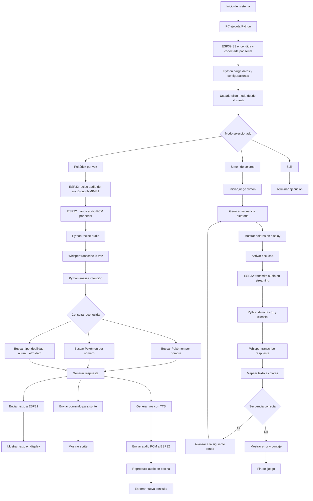
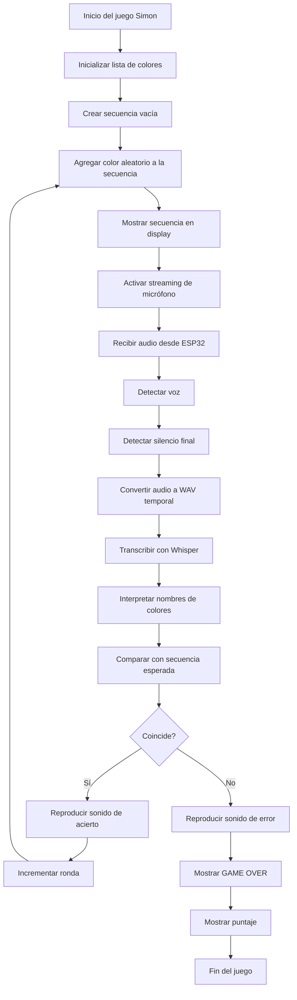
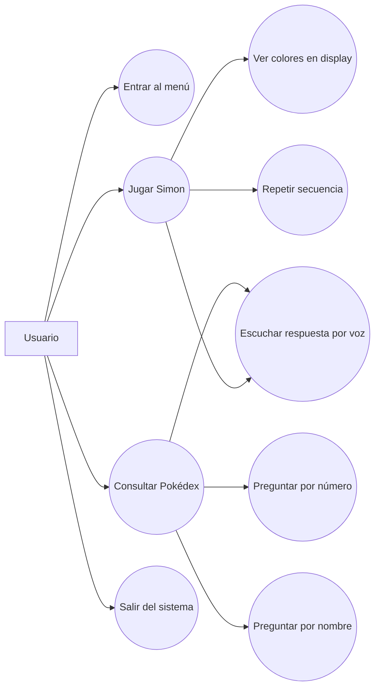
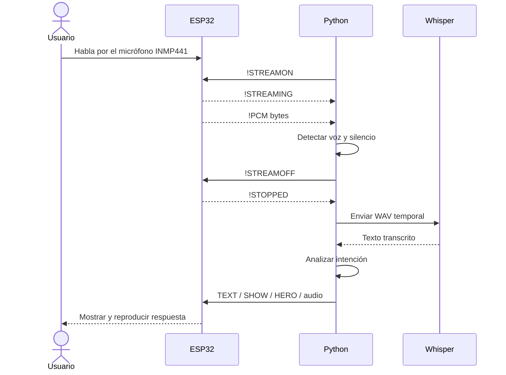
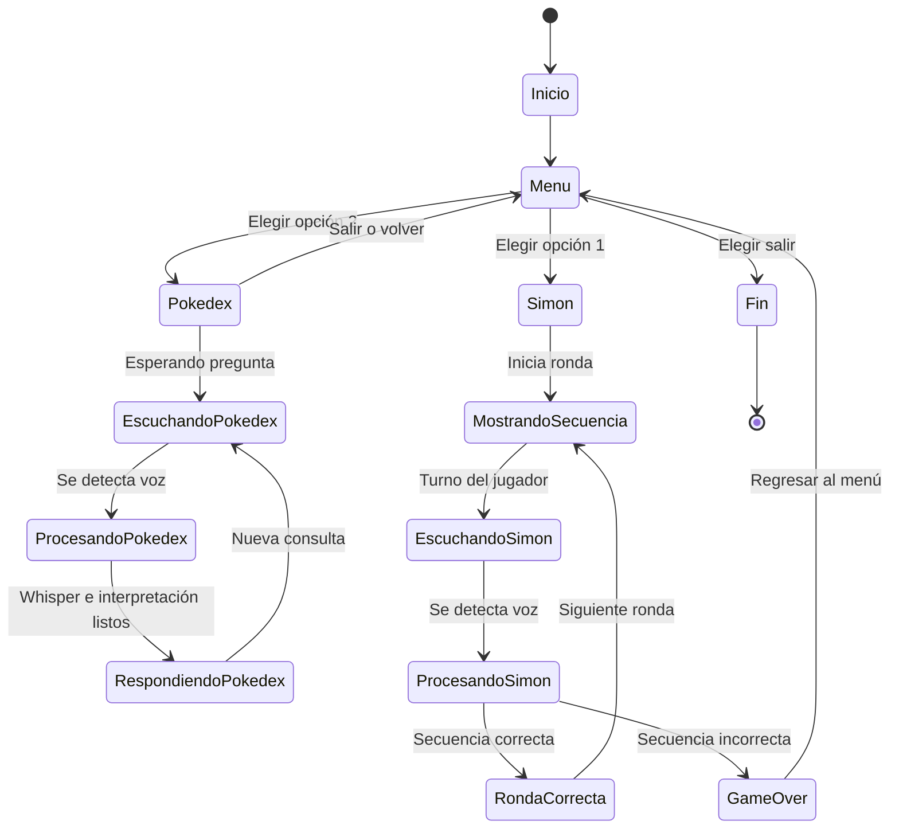

# Pokedex y Simon de Colores

Este proyecto junta dos cosas en una sola app:

1. Una `Pokedex por voz`
2. Un juego estilo `Simon`, pero con colores

La idea general es esta:

- la `PC` corre la lógica en Python
- la `ESP32-S3` se encarga del display, el audio de salida y de mandar el audio del micrófono por serial
- `Whisper` en Python transcribe lo que se dijo

No es un proyecto “de producto final”, sino más bien un proyecto escolar que fue creciendo poco a poco. Por eso todavía hay nombres heredados de Pokémon dentro del código del juego, aunque hoy el Simon ya usa colores.

## Qué hace el proyecto

### 1. Pokédex por voz

La Pokédex puede responder preguntas sobre Pokémon de la primera generación. Por ejemplo:

- `qué tipo es Pikachu`
- `cuál es el pokemon numero 25`
- `cuáles son las debilidades de Charizard`
- `cuánto mide Bulbasaur`

Además:

- muestra texto en el display de la ESP32
- puede mandar el número del Pokémon para que el firmware muestre su sprite
- responde por voz usando TTS
- guarda aliases aprendidos en `data/aprendizaje.json`

### 2. Simon de colores

El juego Simon ya no usa Pokémon ni superhéroes. Ahora trabaja con estos 4 colores:

- `Azul`
- `Amarillo`
- `Rojo`
- `Verde`

El juego:

- genera una secuencia aleatoria
- muestra cada color en el display
- escucha tu respuesta por voz
- compara la secuencia
- sigue avanzando mientras no falles

También comparte el archivo de aprendizaje con la Pokédex para guardar variantes de voz útiles.

## Cómo está conectado todo

El flujo normal de voz ahorita es este:

`INMP441 -> ESP32-S3 -> serial -> Python -> Whisper -> Python decide -> ESP32 responde`

O sea:

- el micrófono `INMP441` está conectado a la `ESP32-S3`
- la ESP32 manda audio PCM por serial
- Python recibe ese audio
- Whisper lo transcribe
- Python decide qué hacer
- luego le manda a la ESP32 el texto, el audio o el comando visual

## Diagrama general del flujo



## Hardware usado

- `ESP32-S3`
- `INMP441` como micrófono I2S
- `MAX98357A` como amplificador I2S
- bocina
- display conectado a la ESP32

## Archivos importantes

- [main.py](/abs/c:/Users/jazie/OneDrive/Documentos/escuela/proyecto-pokedex/pokemon-micropython/main.py)
  Menú principal por teclado

- [pokedex.py](/abs/c:/Users/jazie/OneDrive/Documentos/escuela/proyecto-pokedex/pokemon-micropython/pokedex.py)
  Entrada rápida para ejecutar la Pokédex

- [simon_pokemon.py](/abs/c:/Users/jazie/OneDrive/Documentos/escuela/proyecto-pokedex/pokemon-micropython/simon_pokemon.py)
  Entrada rápida para ejecutar el juego

- [app/desktop/pokedex.py](/abs/c:/Users/jazie/OneDrive/Documentos/escuela/proyecto-pokedex/pokemon-micropython/app/desktop/pokedex.py)
  Lógica real de la Pokédex

- [app/desktop/simon_pokemon.py](/abs/c:/Users/jazie/OneDrive/Documentos/escuela/proyecto-pokedex/pokemon-micropython/app/desktop/simon_pokemon.py)
  Lógica real del juego Simon

- [app/desktop/common_runtime.py](/abs/c:/Users/jazie/OneDrive/Documentos/escuela/proyecto-pokedex/pokemon-micropython/app/desktop/common_runtime.py)
  Funciones compartidas de serial y Whisper

- [data/pokedex.json](/abs/c:/Users/jazie/OneDrive/Documentos/escuela/proyecto-pokedex/pokemon-micropython/data/pokedex.json)
  Datos base de la Pokédex

- [data/aprendizaje.json](/abs/c:/Users/jazie/OneDrive/Documentos/escuela/proyecto-pokedex/pokemon-micropython/data/aprendizaje.json)
  Archivo compartido de aprendizaje para aliases

- [firmware/projects/pokedex-c/pokedex-c.ino](/abs/c:/Users/jazie/OneDrive/Documentos/escuela/proyecto-pokedex/pokemon-micropython/firmware/projects/pokedex-c/pokedex-c.ino)
  Firmware de la ESP32-S3

## Cómo correrlo

### Opción 1. Usar el menú principal

```powershell
py main.py
```

Ese menú deja elegir:

- `1` Juego Simon de colores
- `2` Pokedex por voz
- `0` Salir

### Opción 2. Ejecutar solo la Pokédex

```powershell
py pokedex.py
```

### Opción 3. Ejecutar solo el juego

```powershell
py simon_pokemon.py
```

## Dependencias de Python

Las librerías externas más importantes son estas:

- `pyserial`
- `faster-whisper`
- `numpy`
- `scikit-learn`
- `scipy`
- `pyttsx3`

Si hace falta instalarlas, algo típico sería:

```powershell
pip install pyserial faster-whisper numpy scikit-learn scipy pyttsx3
```

Si usas `.venv`, entonces se instalan dentro de ese entorno.

### Librerías de Python que usa el proyecto

Además de las dependencias externas, el código usa varias librerías de la biblioteca estándar de Python.

#### Librerías externas

- `pyserial`
  para la comunicación serial entre Python y la ESP32

- `faster-whisper`
  para transcribir audio a texto

- `numpy`
  para manejar y transformar audio en arreglos numéricos

- `scikit-learn`
  para el modelo de texto de la Pokédex, sobre todo con `TfidfVectorizer` y `cosine_similarity`

- `scipy`
  para tipos usados en el manejo del modelo, como `spmatrix`

- `pyttsx3`
  para generar la voz TTS de salida en la Pokédex

#### Librerías estándar de Python

- `json`
  para leer y guardar archivos como `pokedex.json` y `aprendizaje.json`

- `os`
  para operaciones del sistema y manejo de archivos

- `random`
  para generar secuencias aleatorias en el Simon

- `re`
  para expresiones regulares y limpieza de texto

- `sys`
  para utilidades generales del intérprete

- `tempfile`
  para crear archivos temporales WAV durante la transcripción o TTS

- `time`
  para pausas, tiempos de espera y control de estados

- `unicodedata`
  para normalizar texto y quitar acentos

- `wave`
  para leer y escribir archivos WAV

- `array`
  para procesar muestras PCM de audio

- `collections.deque`
  para manejar buffers cortos de audio en streaming

- `difflib.SequenceMatcher`
  para comparar similitud entre textos

- `dataclasses`
  para estructuras de datos simples en la Pokédex

- `pathlib.Path`
  para manejar rutas de archivos de forma más clara

## Cómo funciona la Pokédex

En resumen:

1. Python carga `data/pokedex.json`
2. también carga aliases aprendidos desde `data/aprendizaje.json`
3. la ESP32 manda audio del micrófono por serial
4. Python lo convierte a WAV temporal
5. Whisper lo transcribe
6. se intenta detectar el nombre o número del Pokémon
7. Python genera la respuesta
8. la ESP32 muestra texto, sprite y voz de salida

La Pokédex soporta varias formas de identificar:

- por nombre
- por número
- por fragmentos
- por variantes fonéticas
- por aliases aprendidos

## Cómo funciona el juego

En cada ronda:

1. se agrega un color nuevo a la secuencia
2. la ESP32 lo muestra en pantalla
3. cuando termina la secuencia, el juego entra a modo escucha
4. Python recibe el audio de la ESP32 por streaming
5. corta el fragmento cuando detecta voz y luego silencio
6. Whisper transcribe
7. el juego intenta mapear el texto a los 4 colores
8. si acertaste, sigue la siguiente ronda
9. si fallaste, termina y muestra el puntaje

### Diagrama del juego Simon



## Sobre el streaming de audio

Antes el proyecto usaba un comando tipo `!REC <ms>` para pedir una grabación cerrada por tiempo. Eso servía, pero se volvía incómodo cuando la secuencia crecía.

Ahora se agregó un modo de streaming:

- `!STREAMON`
- `!STREAMOFF`
- la ESP32 manda bloques `!PCM <bytes>`

Con eso, Python puede decidir mejor dónde empieza y termina cada intento de voz.

## Aprendizaje

El archivo [aprendizaje.json](/abs/c:/Users/jazie/OneDrive/Documentos/escuela/proyecto-pokedex/pokemon-micropython/data/aprendizaje.json) se usa para guardar variantes de voz que luego ayudan a reconocer mejor nombres.

Ejemplos de lo que puede guardar:

- variantes de nombres de Pokémon
- variantes de colores del Simon
- aliases útiles que se fueron aprendiendo con el uso

La idea es que el sistema se vuelva más tolerante con pronunciaciones y transcripciones raras.

## Comandos importantes entre Python y la ESP32

Algunos comandos útiles del protocolo serial son:

- `TEXT`
- `SHOW`
- `HERO`
- `CLEAR`
- `UNLOCK`
- `!LOAD`
- `!PLAYBUF`
- `!REC`
- `!STREAMON`
- `!STREAMOFF`

No todos se usan igual en todos los modos, pero esos son los principales.

## Explicación del código en C

El firmware principal está en [firmware/projects/pokedex-c/pokedex-c.ino](/abs/c:/Users/jazie/OneDrive/Documentos/escuela/proyecto-pokedex/pokemon-micropython/firmware/projects/pokedex-c/pokedex-c.ino:1).

La idea del código en C es que la ESP32 no tome decisiones “grandes”, sino que funcione como apoyo de hardware para Python. O sea:

- Python decide qué modo está activo
- Python decide qué responder
- la ESP32 se encarga de pantalla, bocina, micrófono y serial

### 1. Librerías y objetos principales

Al inicio del archivo se incluyen:

- `Arduino.h`
- `driver/i2s.h`
- `math.h`
- `DisplayManager.h`
- `HeroLogos.h`
- `SpriteRenderer.h`
- `StartupLogo.h`

Estas librerías permiten:

- usar funciones básicas de Arduino
- configurar I2S para audio
- dibujar texto e imágenes en el display
- usar sprites de Pokémon
- aunque ese archivo sigue existiendo, el juego actual ya no usa logos

También se crea un objeto global:

- `DisplayManager displayManager;`

Ese objeto es el que se usa para limpiar pantalla, dibujar texto, dibujar bitmaps y renderizar el display final.

### 2. Variables globales

Después vienen varias variables que guardan el estado actual del sistema.

Las más importantes son:

- `pokemonIndex`
  guarda qué Pokémon se está mostrando en el modo normal del display

- `displayLocked`
  cuando está en `true`, el display ya no rota solo entre Pokémon

- `displayBlank`
  deja la pantalla en blanco

- `statusMessageActive`
  activa la vista de mensaje de texto

- `heroModeActive`
  activa la vista del Simon por colores

- `heroIndex`
  indica qué color mostrar

- `microphoneStreamingActive`
  indica si la ESP32 está mandando audio del micrófono por streaming a Python

- `audioBuffer` y `audioBufferSize`
  guardan audio PCM recibido desde la computadora para luego reproducirlo por la bocina

Estas variables son importantes porque `renderDisplay()` y `processCommand()` dependen de ellas para saber qué hacer.

### 3. Pines y configuración de audio

El firmware usa dos periféricos I2S:

- uno para salida de audio
- uno para entrada de audio

Salida:

- `SPK_PORT`
- `SPK_BCLK`
- `SPK_LRC`
- `SPK_DIN`

Entrada:

- `MIC_PORT`
- `MIC_SCK`
- `MIC_WS`
- `MIC_SD`

Además se definen constantes como:

- `SAMPLE_RATE = 16000`
- `BUFFER_FRAMES = 256`
- `SERIAL_BAUDRATE = 921600`
- `MIC_MAX_RECORD_MS = 28000`

Eso significa que el audio del micrófono y de reproducción trabaja a `16 kHz`, que es un formato práctico para voz y para Whisper.

### 4. Inicialización del speaker y del micrófono

Hay dos funciones importantes:

- `initSpeaker()`
- `initMicrophone()`

`initSpeaker()` configura I2S en modo transmisión, para enviar muestras de audio al amplificador y la bocina.

`initMicrophone()` configura I2S en modo recepción, para leer audio desde el `INMP441`.

La ESP32 aquí no “interpreta” el sonido, solo mueve muestras PCM entre hardware y serial.

### 5. Sonidos simples del sistema

El firmware tiene efectos básicos para el juego:

- `soundSuccess()`
- `soundError()`
- `soundStart()`
- `soundRound()`
- `soundGameOver()`

Todos usan `playTone()`.

`playTone()` genera una onda seno en software y la manda por I2S al speaker. Por eso el juego puede hacer sonidos de acierto, error, inicio o fin sin depender de archivos WAV.

### 6. Render del display

Aquí hay dos funciones visuales clave:

- `renderStatusMessage()`
- `renderHeroCard()`

`renderStatusMessage()` dibuja una o dos líneas de texto.

`renderHeroCard()` dibuja la pantalla especial del Simon:

- color 1: Azul
- color 2: Amarillo
- color 3: Rojo
- color 4: Verde

Ahora esa pantalla ya no usa logos; muestra directamente el nombre del color.

### 7. Cómo decide qué mostrar

La función importante aquí es `renderDisplay()`.

Esa función revisa el estado general y decide qué dibujar, en este orden:

1. si `displayBlank` está activo, deja la pantalla en blanco
2. si `statusMessageActive` está activo, muestra texto
3. si `heroModeActive` está activo, muestra la tarjeta del color
4. si sigue la animación de arranque, dibuja el logo inicial
5. si nada de eso aplica, entra al modo normal de Pokédex y rota entre Pokémon

Eso hace que el display tenga varios “modos”, aunque todo viva en un solo firmware.

### 8. Audio recibido desde Python

Cuando Python quiere que la ESP32 reproduzca voz o audio, usa este flujo:

1. manda `!LOAD <bytes>`
2. la ESP32 reserva memoria
3. la ESP32 lee exactamente esos bytes
4. Python manda `!PLAYBUF`
5. la ESP32 reproduce el buffer

Las funciones que hacen esto son:

- `readExactBytes()`
- `clearAudioBuffer()`
- `loadPcmToBuffer()`
- `playBufferedAudio()`

La lógica es simple:

- Python genera el audio
- Python lo convierte a PCM
- la ESP32 lo recibe
- la ESP32 lo reproduce

### 9. Grabación tradicional del micrófono

Antes de agregar streaming, la forma de pedir audio era con:

- `!REC <ms>`

Eso llama a `streamMicrophoneAudio(durationMs)`.

Esa función:

1. calcula cuántos frames necesita
2. lee audio del micrófono con `i2s_read`
3. manda por serial una cabecera `!AUDIO <bytes>`
4. manda todos los bytes PCM
5. al final manda `!DONE`

Ese modo todavía existe, aunque el proyecto ya usa más el streaming continuo.

### 10. Streaming del micrófono

Para mejorar la escucha por voz, el firmware ahora soporta:

- `!STREAMON`
- `!STREAMOFF`

Cuando llega `!STREAMON`:

- `microphoneStreamingActive = true`
- la ESP32 responde `!STREAMING`

Cuando llega `!STREAMOFF`:

- `microphoneStreamingActive = false`
- la ESP32 responde `!STOPPED`

Mientras el streaming está activo, en cada vuelta del `loop()` se llama a `streamMicrophoneChunk()`.

`streamMicrophoneChunk()`:

1. lee un bloque pequeño del micrófono
2. manda una cabecera `!PCM <bytes>`
3. manda enseguida esos bytes

Con eso, Python recibe audio en trozos y ya puede decidir por su cuenta cuándo empieza o termina una frase.

### 11. Protocolo serial

La función más importante del firmware es `processCommand(const String& rawCommand)`.

Esa función recibe una línea de texto desde Python y decide qué hacer.

Comandos importantes:

- `TEXT`
  muestra texto en el display

- `SHOW`
  muestra un Pokémon por número

- `HERO`
  muestra un color del Simon

- `!LOAD`
  carga audio PCM en memoria

- `!PLAYBUF`
  reproduce el audio cargado

- `!REC`
  hace una captura cerrada del micrófono

- `!STREAMON`
  activa stream continuo del micrófono

- `!STREAMOFF`
  detiene stream continuo del micrófono

- `CLEAR`
  limpia la pantalla

- `UNLOCK`
  libera el display para que vuelva al modo normal

- `OK`, `ERR`, `START`, `ROUND`, `GAMEOVER`, `TEST`
  disparan sonidos del sistema

Cuando un comando sale bien, la placa suele responder con algo como:

- `ACK:TEXT`
- `ACK:SHOW`
- `ACK:HERO`
- `ACK:OK`

Eso le sirve a Python para saber si la orden fue aceptada.

### 12. Lectura de comandos seriales

La función `readSerialCommands()` se encarga de leer el puerto serial carácter por carácter.

Va armando una línea en `serialLine` hasta encontrar `\n`.

Cuando encuentra fin de línea:

- llama a `processCommand(serialLine)`
- limpia el buffer

Es una implementación simple, pero suficiente para este proyecto porque los comandos son cortos.

### 13. setup()

En `setup()` se hace la preparación inicial:

1. inicia el serial
2. inicia el display
3. inicia speaker
4. inicia micrófono
5. registra el tiempo de inicio para la animación
6. imprime mensaje de arranque
7. reproduce un sonido inicial

Es básicamente la fase de “encendido”.

### 14. loop()

En `loop()` pasan 3 cosas:

1. `readSerialCommands()`
   revisa si Python mandó algo

2. si `microphoneStreamingActive` está activo:
   manda un chunk del micrófono

3. `renderDisplay()`
   actualiza lo que se ve en pantalla

Entonces el firmware está todo el tiempo:

- esperando comandos
- mandando audio si hace falta
- dibujando la pantalla correcta

### 15. Resumen corto del firmware

Si lo quieres pensar fácil, el código en C convierte a la ESP32 en un periférico inteligente para Python.

La PC:

- piensa
- interpreta voz
- decide qué responder

La ESP32:

- muestra
- reproduce
- escucha
- manda audio del micrófono
- recibe comandos y responde con ACK

Eso permite repartir el trabajo:

- Python hace la parte “inteligente”
- la ESP32 hace la parte de hardware y tiempo real

## Notas importantes

- El puerto serial está configurado directamente en el código. Si tu placa aparece en otro `COM`, hay que cambiarlo.
- Para ver el modo de streaming nuevo, sí necesitas volver a cargar el firmware en la ESP32.
- El juego todavía vive en un archivo llamado `simon_pokemon.py`, aunque ya no usa Pokémon.
- Algunas partes del proyecto siguen teniendo nombres viejos por cómo fue evolucionando.

## Estructura rápida

```text
pokemon-micropython/
|-- app/
|   `-- desktop/
|       |-- common_runtime.py
|       |-- pokedex.py
|       `-- simon_pokemon.py
|-- data/
|   |-- aprendizaje.json
|   `-- pokedex.json
|-- firmware/
|   `-- projects/
|       `-- pokedex-c/
|           `-- pokedex-c.ino
|-- main.py
|-- pokedex.py
|-- simon_pokemon.py
`-- README.md
```

## Diseño estructurado usado en el proyecto

Para este proyecto se tomó la opción `HIPO`, porque se adapta bien a cómo está dividido el sistema.

`HIPO` significa:

- `Hierarchy`
- `Input`
- `Process`
- `Output`

La idea es describir el proyecto por módulos y, en cada módulo, explicar:

- qué entra
- qué proceso hace
- qué salida produce

### Jerarquía general

```text
Sistema principal
|
|-- main.py
|   |-- mostrar menú
|   |-- abrir juego
|   `-- abrir pokédex
|
|-- app/desktop/pokedex.py
|   |-- escuchar audio desde ESP32
|   |-- transcribir con Whisper
|   |-- identificar consulta
|   |-- buscar datos del Pokémon
|   `-- responder por display y voz
|
|-- app/desktop/simon_pokemon.py
|   |-- generar secuencia
|   |-- mostrar colores
|   |-- escuchar respuesta del jugador
|   |-- transcribir audio
|   |-- comparar secuencia
|   `-- avanzar ronda o terminar
|
`-- firmware/projects/pokedex-c/pokedex-c.ino
    |-- controlar display
    |-- reproducir audio
    |-- capturar audio del micrófono
    `-- comunicarse por serial con Python
```

### HIPO de `main.py`

**Entrada**

- opción elegida por teclado

**Proceso**

- mostrar menú principal
- leer la opción del usuario
- decidir si abre el juego, la pokédex o termina

**Salida**

- ejecución del modo seleccionado

### HIPO de la Pokédex

**Entrada**

- audio del usuario desde el micrófono conectado a la ESP32
- datos de `pokedex.json`
- aliases aprendidos de `aprendizaje.json`

**Proceso**

- recibir audio por serial
- detectar fragmento hablado
- convertir audio a WAV temporal
- transcribir con Whisper
- identificar intención
- localizar el Pokémon o el dato pedido
- construir la respuesta

**Salida**

- texto en display
- sprite o número del Pokémon en pantalla
- audio TTS reproducido por la ESP32

### HIPO del juego Simon

**Entrada**

- secuencia interna del juego
- audio hablado por el jugador
- aliases aprendidos

**Proceso**

- generar secuencia de colores
- mostrar la secuencia en display
- activar escucha por streaming
- recibir audio desde la ESP32
- transcribir con Whisper
- convertir texto a nombres de colores
- comparar contra la secuencia esperada

**Salida**

- avance de ronda si la respuesta es correcta
- mensaje de error y puntaje final si falla
- sonidos de acierto o error

### HIPO del firmware en C

**Entrada**

- comandos seriales desde Python
- audio PCM desde Python
- audio del micrófono INMP441

**Proceso**

- interpretar comandos
- dibujar mensajes, sprites o colores en el display
- reproducir audio por I2S
- mandar audio del micrófono a Python

**Salida**

- pantalla actualizada
- sonido por bocina
- audio PCM enviado a la computadora
- respuestas `ACK` por serial

### Por qué se eligió HIPO

Se eligió porque:

- el proyecto ya está dividido por módulos
- es fácil relacionarlo con archivos reales
- sirve para explicar el sistema sin meterse demasiado en teoría
- queda bien para una entrega escolar

## UML en Mermaid

Además de la parte de HIPO, también se pueden documentar varias vistas del proyecto usando diagramas tipo `UML` hechos con `Mermaid`.

Aquí se agregaron 3 que sí tienen sentido para este sistema:

- `Casos de uso`
- `Secuencia`
- `Estado`

### 1. Casos de uso

Este diagrama muestra qué puede hacer el usuario dentro del proyecto.



### 2. Diagrama de secuencia

Este diagrama enseña cómo se comunican el usuario, Python, Whisper y la ESP32 cuando se hace una consulta por voz.



### 3. Diagrama de estados

Este diagrama resume los estados principales del sistema completo.



### Nota

No son diagramas UML “puristas” al 100%, pero para documentación escolar sí cumplen muy bien porque explican:

- qué hace el usuario
- cómo se comunican los módulos
- en qué estados se mueve el sistema

## Cosas que todavía se pueden mejorar

- afinar todavía más el reconocimiento de voz del juego
- limpiar más nombres heredados de Pokémon dentro del Simon
- simplificar algunos nombres internos como `heroModeActive` para que coincidan mejor con el juego actual
- mejorar la detección para cortar exactamente cuando ya reconoció toda la secuencia
- ordenar un poco más el archivo `aprendizaje.json`

## Resumen corto

Si solo quieres probar rápido:

1. conecta la ESP32
2. verifica el `COM`
3. corre `py main.py`
4. entra a la Pokédex o al juego
5. si cambiaste firmware, reflashea la placa antes de probar

Si después quieres, también te puedo generar una segunda documentación más corta tipo “manual de uso” y dejar esta como documentación general del proyecto.
